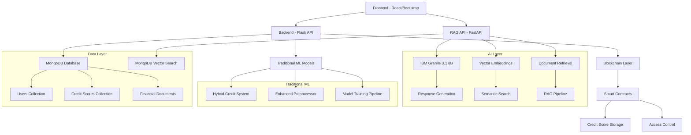
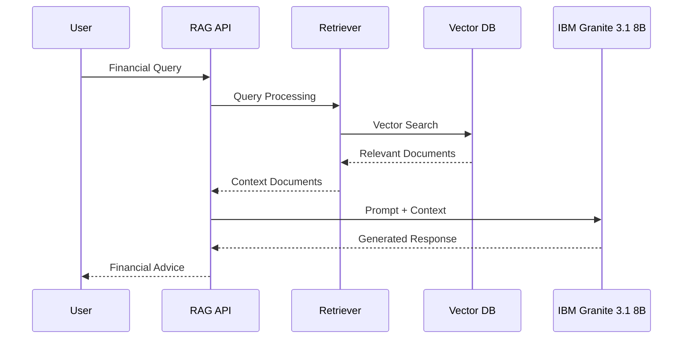

# NexaCred - Advanced Credit Scoring & Financial AI Platform


## 🚀 Overview

**NexaCred** is a comprehensive, fraud-resistant credit scoring system that combines traditional machine learning with cutting-edge AI technologies. The platform integrates IBM Granite 3.1 8B language models with Retrieval-Augmented Generation (RAG) to provide intelligent financial advice, risk assessment, and regulatory compliance guidance.

### 🎯 Key Features

- 🤖 **IBM Granite 3.1 8B Integration**: Advanced language model for financial analysis
- 🔍 **RAG-Powered Financial Assistant**: Intelligent chatbot with Indian financial regulations knowledge
- 🛡️ **Fraud-Resistant Architecture**: Advanced ML algorithms and blockchain integration
- 📊 **Comprehensive Credit Scoring**: Multi-model hybrid credit assessment system
- 🏦 **Financial Regulatory Compliance**: Real-time guidance on Indian banking regulations
- 🔗 **Blockchain Integration**: Immutable credit score storage and verification
- 🌐 **Full-Stack Solution**: Complete web application with modern UI/UX
- ⚡ **Real-time Processing**: Fast credit score calculations and AI responses

### 🛠️ Tech Stack

- **AI/ML**: IBM Granite 3.1 8B, scikit-learn, pandas, NumPy, sentence-transformers
- **RAG System**: Vector embeddings, semantic search, MongoDB Atlas Vector Search (ready)
- **Frontend**: React (Vite), HTML5, Bootstrap 5, JavaScript (ES6+)
- **Backend**: Python Flask, FastAPI, MongoDB, RESTful APIs
- **Blockchain**: Solidity smart contracts, Web3 integration
- **Database**: MongoDB with PyMongo, Vector Search capabilities
- **Security**: bcrypt, CORS protection, secure API endpoints

## 📁 Project Structure

```
nexacred/
├── frontend/                     # Web interfaces
│   ├── index.html               # Bootstrap-based login/register forms  
│   └── nexacred/                # React application (Vite-based)
│       ├── src/                 # React components and assets
│       ├── public/              # Static assets
│       ├── package.json         # Node.js dependencies
│       └── vite.config.js       # Vite configuration
├── backend/                     # Flask API server
│   ├── app.py                  # Main Flask application with routes
│   ├── config.py               # MongoDB connection configuration
│   └── requirements.txt        # Python dependencies
├── blockchain/                  # Smart contracts & Web3 integration
│   ├── CreditScore.sol         # Solidity contract for credit scores
│   ├── NexaCred.sol           # Main platform contract
│   └── web3_integration.py    # Python Web3 interface
├── ml/                         # Machine Learning & AI components
│   ├── rag_chatbot/           # 🔥 MAIN RAG CHATBOT SYSTEM
│   │   ├── models/            # AI model components
│   │   │   ├── generator.py   # IBM Granite 3.1 8B integration
│   │   │   └── embeddings.py  # Sentence transformers
│   │   ├── retrieval/         # Document retrieval system
│   │   │   ├── dummy.py       # Sample financial regulations
│   │   │   └── mongo_stub.py  # MongoDB Vector Search (ready)
│   │   ├── pipeline/          # RAG orchestration
│   │   │   ├── rag.py         # Main RAG pipeline
│   │   │   ├── token_utils.py # Token management
│   │   │   └── chunking.py    # Text processing
│   │   ├── api/               # FastAPI web service
│   │   │   └── app.py         # REST endpoints with Swagger docs
│   │   ├── cli.py             # Interactive command-line interface
│   │   ├── config.py          # Configuration management
│   │   ├── prompts.py         # Financial prompt templates
│   │   └── README.md          # RAG chatbot documentation
│   ├── credit_scoring.py       # Traditional ML credit models
│   ├── hybrid_credit_system.py # Multi-model credit assessment
│   ├── enhanced_preprocessor.py # Advanced data preprocessing
│   ├── financial_assistant.py  # Main financial AI coordinator
│   ├── granite_financial_ai.py # Enhanced financial analysis
│   └── train_model.py          # Model training scripts
├── datasets/                   # Training and test data
│   ├── train.csv              # Credit scoring training data
│   └── test.csv               # Model evaluation data
├── complete_system_test.py     # Comprehensive system testing
├── quick_test.py              # Quick functionality verification
└── README.md                  # Main project documentation
```

## 🤖 RAG Chatbot System

The centerpiece of NexaCred's AI capabilities is the **RAG (Retrieval-Augmented Generation) Chatbot** located in `ml/rag_chatbot/`. This system provides:

### 🎯 Core Features

- **IBM Granite 3.1 8B Instruct**: State-of-the-art language model for financial responses
- **Intelligent Retrieval**: Semantic search through Indian financial regulations
- **Vector Embeddings**: sentence-transformers for document similarity
- **MongoDB Ready**: Designed for MongoDB Atlas Vector Search integration
- **Production-Ready**: Complete FastAPI service with Swagger documentation
- **Interactive CLI**: Command-line interface for direct usage

### 🔧 RAG Components

1. **Models** (`ml/rag_chatbot/models/`)
   - `generator.py`: IBM Granite model with intelligent caching
   - `embeddings.py`: Sentence transformer embeddings

2. **Retrieval** (`ml/rag_chatbot/retrieval/`)
   - `dummy.py`: Sample Indian financial regulations for testing
   - `mongo_stub.py`: MongoDB Atlas Vector Search integration (ready for implementation)

3. **Pipeline** (`ml/rag_chatbot/pipeline/`)
   - `rag.py`: Complete RAG orchestration
   - `token_utils.py`: Context window management
   - `chunking.py`: Document segmentation

4. **API** (`ml/rag_chatbot/api/`)
   - `app.py`: FastAPI service with `/health` and `/infer` endpoints

### 📚 Financial Knowledge Areas

The RAG system specializes in:
- **Loans**: Personal, home, business loan regulations
- **Credit Cards**: Interest rates, eligibility, compliance
- **P2P Lending**: RBI guidelines and platform regulations
- **Digital Payments**: UPI, NEFT, RTGS regulations
- **Banking**: KYC, AML, account opening procedures
- **Compliance**: Regulatory requirements and penalties

## 🛠️ Setup Instructions

### Prerequisites

Before setting up NexaCred, ensure you have the following installed:

- **Python 3.8+**: [Download Python](https://python.org/downloads/)
- **MongoDB**: [Install MongoDB Community](https://docs.mongodb.com/manual/installation/)
- **Node.js 16+**: [Download Node.js](https://nodejs.org/) (for React frontend)
- **Git**: [Install Git](https://git-scm.com/downloads)
- **CUDA** (optional): For GPU acceleration of AI models

### 1. Clone the Repository

```bash
git clone https://github.com/your-username/nexacred.git
cd nexacred
```

### 2. RAG Chatbot Setup (Main AI System)

#### Install Python Dependencies

```bash
cd ml/rag_chatbot
pip install torch transformers sentence-transformers
pip install fastapi uvicorn pydantic-settings
pip install pymongo  # For MongoDB integration (when ready)
```

#### Test RAG System

```bash
# Run smoke tests
python test_smoke.py

# Start interactive CLI
python -m rag_chatbot

# Or test single query
python cli.py --query "What are RBI guidelines for personal loans?"
```

#### Start RAG API Server

```bash
# Start FastAPI server
python -m uvicorn api.app:app --host 0.0.0.0 --port 8000 --reload

# View API documentation
# Visit: http://localhost:8000/docs
```

#### Test RAG API

```bash
# Health check
curl http://localhost:8000/health

# Query endpoint
curl -X POST "http://localhost:8000/infer" \
  -H "Content-Type: application/json" \
  -d '{"query": "What are the eligibility criteria for credit cards in India?"}'
```

### 3. Traditional ML System Setup

#### Install ML Dependencies

```bash
cd ml
pip install -r requirements.txt  # If requirements.txt exists in ml/
pip install scikit-learn pandas numpy matplotlib seaborn
```

#### Train Credit Scoring Models

```bash
# Train hybrid credit scoring system
python train_model.py

# Run comprehensive system test
cd ..
python complete_system_test.py

# Quick functionality test
python quick_test.py
```

### 4. Backend Setup

#### Install Backend Dependencies

```bash
cd backend
pip install -r requirements.txt
```

#### Start MongoDB

Make sure MongoDB is running on your system:

```bash
# macOS (with Homebrew)
brew services start mongodb/brew/mongodb-community

# Ubuntu/Debian
sudo systemctl start mongod

# Windows
# Start MongoDB service from Services app or run mongod.exe
```

#### Start Flask Backend

```bash
python app.py
```

The backend server will start at `http://localhost:5000`

### 5. Frontend Setup

#### React Frontend (Primary)

```bash
cd frontend/nexacred
npm install
npm run dev
```

The React app will start at `http://localhost:5173`

#### Bootstrap Frontend (Alternative)

```bash
cd frontend
python -m http.server 8080
# Visit: http://localhost:8080
```

### 5. Blockchain Smart Contract Deployment

#### Option A: Using Remix IDE (Recommended for Testing)

1. Open [Remix IDE](https://remix.ethereum.org/)
2. Create a new file `CreditScore.sol`
3. Copy the contract code from `blockchain/CreditScore.sol`
4. Compile with Solidity compiler version `^0.8.19`
5. Deploy to your preferred network (Ganache, testnet, etc.)

#### Option B: Using Hardhat (Advanced)

```bash
# Install Hardhat (requires Node.js)
npm install --save-dev hardhat
npx hardhat init

# Copy CreditScore.sol to contracts folder
# Configure hardhat.config.js
# Deploy with:
npx hardhat run scripts/deploy.js --network localhost
```

## 🔧 Configuration

### MongoDB Configuration

The system uses MongoDB for user data and credit score storage. Configuration is handled in `backend/config.py`:

```python
# Default MongoDB URI
MONGO_URI = 'mongodb://localhost:27017/creditdb'

# Collections
- users: User accounts and profiles  
- credit_scores: Historical credit score data
```

### Environment Variables

You can customize the configuration using environment variables:

```bash
export MONGO_URI="mongodb://localhost:27017/creditdb"
export FLASK_ENV="development"  # or "production"
```

## 🚀 Usage Guide

### 1. RAG Chatbot Usage

#### Command Line Interface

```bash
cd ml/rag_chatbot

# Interactive chat mode
python -m rag_chatbot
# Type your questions about Indian financial regulations

# Single query mode
python cli.py --query "What are the KYC requirements for opening a bank account?"

# Health check
python cli.py --health
```

#### Web API Usage

```bash
# Start the API server
python -m uvicorn api.app:app --port 8000

# Example queries via curl
curl -X POST "http://localhost:8000/infer" \
  -H "Content-Type: application/json" \
  -d '{
    "query": "What are the RBI guidelines for peer-to-peer lending?",
    "use_dummy_retriever": true
  }'
```

#### Python Integration

```python
from rag_chatbot.pipeline.rag import RAGPipeline
from rag_chatbot.retrieval.dummy import DummyRetriever
from rag_chatbot.config import Config

# Initialize RAG system
config = Config()
retriever = DummyRetriever(config)
pipeline = RAGPipeline(retriever, config)

# Ask questions
response = pipeline.generate_response(
    "What are the eligibility criteria for personal loans in India?"
)

print(f"Answer: {response['response']}")
print(f"Sources: {len(response['retrieved_docs'])} documents")
```

### 2. Credit Scoring System

#### Traditional ML Models

```python
from ml.hybrid_credit_system import HybridCreditScoringSystem
import pandas as pd

# Initialize system
credit_system = HybridCreditScoringSystem()

# Load and prepare data
# (Assuming you have customer data)
customer_data = pd.DataFrame([{
    'Annual_Income': 750000,
    'Credit_Utilization_Ratio': 0.25,
    'Num_Credit_Card': 3,
    'Num_of_Delayed_Payment': 1,
    'Outstanding_Debt': 15000
}])

# Get credit prediction
prediction, probabilities = credit_system.predict_credit_score(
    customer_data, 'random_forest'
)

print(f"Credit Category: {prediction[0]}")
print(f"Confidence: {probabilities[0]:.2%}")
```

#### Enhanced Financial Analysis

```python
from ml.financial_assistant import NexaCredFinancialAssistant

# Initialize assistant
assistant = NexaCredFinancialAssistant()

# Get comprehensive analysis
result = assistant.get_score("USER_001", {
    'annual_income': 750000,
    'debt_to_income_ratio': 0.22,
    'payment_history_score': 1.6,
    'credit_utilization_ratio': 0.18,
    'age': 28
})

print(f"Credit Score: {result['credit_score']}")
print(f"Category: {result['category']}")
print(f"Risk Level: {result['risk_level']}")
```

### 3. System Integration Testing

#### Quick System Test

```bash
# Run quick functionality test
python quick_test.py
```

#### Comprehensive System Test

```bash
# Run full system evaluation
python complete_system_test.py
```

This will test:
- Data preprocessing pipeline
- Traditional ML model training
- RAG chatbot functionality
- System integration
- Performance metrics

### 4. Smart Contract Interaction

The blockchain component provides:

- **Credit Score Storage**: Immutable storage of credit scores
- **Access Control**: Only authorized scorers can update scores
- **Audit Trail**: Complete history of score changes
- **Batch Operations**: Efficient bulk score updates

## 🔒 Security Features

### AI/ML Security
- **Model Security**: Secure model loading and inference pipelines
- **Input Validation**: Comprehensive validation for all AI model inputs
- **Token Management**: Intelligent context window management
- **Rate Limiting**: Protection against AI service abuse

### Data Protection
- **Password Hashing**: bcrypt with salt for secure password storage
- **Input Validation**: Comprehensive validation for all user inputs  
- **CORS Protection**: Proper cross-origin request handling
- **MongoDB Injection Prevention**: Parameterized queries
- **Vector Embeddings**: Secure semantic search without data exposure

### API Security
- **Authentication**: Secure user authentication system
- **Authorization**: Role-based access control
- **HTTPS Ready**: Production-ready SSL/TLS configuration
- **Error Handling**: Secure error messages without information disclosure
- **API Documentation**: Automatic Swagger/OpenAPI documentation

### Blockchain Security
- **Access Control**: Multi-level permission system
- **Input Validation**: Smart contract input sanitization
- **Reentrancy Protection**: Safe external calls
- **Emergency Controls**: Pause functionality for critical situations

## 📊 System Architecture



### 🔄 RAG Workflow



## 🧪 Testing

### RAG Chatbot Testing

```bash
cd ml/rag_chatbot

# Run comprehensive smoke tests
python test_smoke.py

# Test individual components
python -c "from models.generator import load_generator_from_config; from config import Config; print('Testing model loading...')"

# API testing
curl -X POST "http://localhost:8000/infer" \
  -H "Content-Type: application/json" \
  -d '{"query": "Test query about loans"}'
```

### System Integration Testing

```bash
# Quick system test (recommended first)
python quick_test.py

# Comprehensive system test
python complete_system_test.py
```

### Backend Testing
```bash
cd backend
python -m pytest tests/  # (create tests as needed)

# API endpoint testing
curl -X GET http://localhost:5000/
curl -X POST http://localhost:5000/register -H "Content-Type: application/json" -d '{"username":"test","email":"test@example.com","password":"test123"}'
```

### Frontend Testing

#### React Frontend
```bash
cd frontend/nexacred
npm test
npm run test:coverage
```

#### Manual Testing
- Navigate through the web interface
- Test user registration and login
- Verify credit scoring functionality
- Test RAG chatbot integration

### Smart Contract Testing
```bash
# With Hardhat
npx hardhat test

# With Truffle
truffle test
```

### Load Testing

```bash
# Install testing tools
pip install locust

# Create load test for RAG API
# Then run: locust -f load_test.py --host=http://localhost:8000
```

## 📈 Performance Considerations

### AI Model Performance
- **Model Caching**: Intelligent model loading and caching system
- **4-bit Quantization**: Memory-efficient model inference with bitsandbytes
- **Token Management**: Efficient context window utilization
- **Batch Processing**: Optimized batch inference for multiple queries
- **GPU Acceleration**: CUDA support for faster model inference

### RAG System Optimization
- **Vector Indexing**: Optimized embedding search with MongoDB Vector Search
- **Semantic Caching**: Cache frequently requested document retrievals
- **Chunking Strategy**: Intelligent document segmentation for better retrieval
- **Embedding Efficiency**: Fast sentence transformer operations

### Database Optimization
- **Vector Search**: MongoDB Atlas Vector Search for semantic similarity
- **Indexed Fields**: Optimized queries for users, credit scores, and documents
- **Connection Pooling**: Efficient concurrent request handling
- **Query Optimization**: Proper aggregation pipelines and indexing

### ML Model Performance  
- **Feature Scaling**: Optimized preprocessing for better model performance
- **Cross-validation**: Robust model validation and selection
- **Hyperparameter Tuning**: Automated optimization for best results
- **Model Ensemble**: Hybrid approaches for improved accuracy

### Blockchain Efficiency
- **Gas Optimization**: Efficient smart contract operations
- **Batch Operations**: Multiple score updates in single transactions
- **Event Logging**: Efficient blockchain data retrieval

## 🛡️ Production Deployment

### RAG Chatbot Deployment

1. **Model Requirements**:
```bash
# GPU recommended for IBM Granite 3.1 8B
# RAM: 32GB+ recommended
# Storage: 20GB+ for model files
```

2. **Environment Setup**:
```bash
export GRANITE_MODEL_ID="ibm-granite/granite-3.1-8b-instruct"
export EMBEDDING_MODEL_ID="sentence-transformers/all-MiniLM-L6-v2"
export MONGODB_URI="mongodb+srv://cluster.mongodb.net/nexacred"
```

3. **Production API Server**:
```bash
# Install production dependencies
pip install uvicorn[standard] gunicorn

# Start with Gunicorn + Uvicorn workers
gunicorn -w 4 -k uvicorn.workers.UvicornWorker api.app:app --bind 0.0.0.0:8000
```

### Backend Deployment

1. **Use a Production WSGI Server** (e.g., Gunicorn):
```bash
pip install gunicorn
gunicorn -w 4 -b 0.0.0.0:5000 app:app
```

2. **Set Environment Variables**:
```bash
export FLASK_ENV=production
export MONGO_URI=mongodb+srv://production-cluster.mongodb.net/nexacred
export SECRET_KEY=your-secret-key
```

3. **Use a Reverse Proxy** (nginx):
```nginx
upstream nexacred_backend {
    server 127.0.0.1:5000;
}

upstream nexacred_rag {
    server 127.0.0.1:8000;
}

server {
    listen 443 ssl;
    server_name yourdomain.com;
    
    # SSL configuration
    ssl_certificate /path/to/cert.pem;
    ssl_certificate_key /path/to/private.key;
    
    # Backend API
    location /api/ {
        proxy_pass http://nexacred_backend/;
        proxy_set_header Host $host;
        proxy_set_header X-Real-IP $remote_addr;
    }
    
    # RAG API
    location /rag/ {
        proxy_pass http://nexacred_rag/;
        proxy_set_header Host $host;
        proxy_set_header X-Real-IP $remote_addr;
    }
    
    # Static files
    location / {
        root /var/www/nexacred/frontend/nexacred/dist;
        try_files $uri $uri/ /index.html;
    }
}
```

### Database Deployment
- **MongoDB Atlas**: Use MongoDB Atlas for cloud deployment with Vector Search
- **Replica Sets**: Configure replica sets for high availability
- **Vector Search Index**: Set up vector search indexes for RAG embeddings
- **Automated Backups**: Configure automated backups and point-in-time recovery

### Frontend Deployment
- **Build React App**: `npm run build` for production-optimized bundle
- **CDN Integration**: Use CDN for static assets and faster loading
- **HTTPS**: Implement HTTPS with Let's Encrypt or commercial certificates
- **Caching**: Configure proper caching headers for static assets

### AI Model Deployment
- **Model Caching**: Pre-download models to avoid startup delays
- **GPU Support**: Use NVIDIA GPUs for faster inference
- **Load Balancing**: Distribute AI workload across multiple instances
- **Monitoring**: Implement model performance and health monitoring

## 🤝 Contributing

We welcome contributions to Nexacred! Please follow these steps:

1. Fork the repository
2. Create a feature branch (`git checkout -b feature/amazing-feature`)
3. Commit your changes (`git commit -m 'Add amazing feature'`)
4. Push to the branch (`git push origin feature/amazing-feature`)
5. Open a Pull Request

### Development Guidelines
- Follow PEP 8 for Python code
- Use meaningful commit messages
- Add tests for new features
- Update documentation as needed


## 🙏 Acknowledgments

- **IBM Granite Team** for the powerful 3.1 8B Instruct language model
- **Hugging Face** community for the transformers and model hosting infrastructure
- **MongoDB** team for Vector Search capabilities and flexible database solutions
- **Sentence Transformers** developers for semantic embedding tools
- **scikit-learn** team for the excellent traditional ML library
- **FastAPI** and **Flask** communities for robust web framework foundations
- **React** and **Vite** teams for modern frontend development tools
- **Bootstrap** team for responsive UI components
- **Solidity** and **Ethereum** communities for blockchain capabilities

## 🔮 Future Roadmap

### Short Term (Q1 2025)
- [ ] Complete MongoDB Atlas Vector Search integration
- [ ] Advanced fine-tuning of IBM Granite model for Indian financial context
- [ ] Real-time financial news integration
- [ ] Enhanced fraud detection algorithms

### Medium Term (Q2-Q3 2025)
- [ ] Multi-language support (Hindi, regional Indian languages)
- [ ] Advanced conversation memory and context tracking
- [ ] Integration with real banking APIs for live data
- [ ] Mobile application development

### Long Term (Q4 2025 & Beyond)
- [ ] AI-powered investment advisory features
- [ ] Advanced risk modeling with alternative data sources
- [ ] Regulatory compliance automation
- [ ] Cross-border financial regulation knowledge

---

**NexaCred** - Empowering Financial Intelligence with AI 🚀

*Built with ❤️ by the NexaCred Development Team*

**Key Technologies**: IBM Granite 3.1 8B • RAG • MongoDB Vector Search • React • FastAPI • Blockchain
