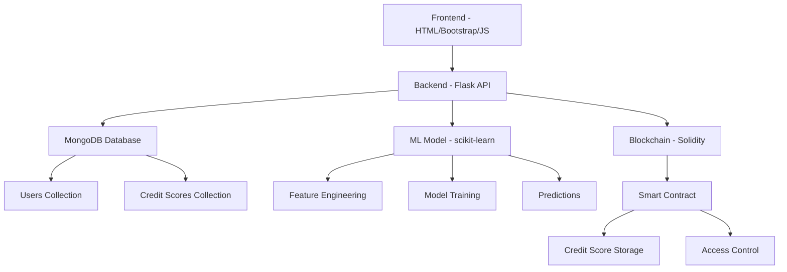

# Nexacred - Fraud-Resistant Credit Scoring System


## 🚀 Overview

**Nexacred** is a comprehensive, fraud-resistant credit scoring system that combines traditional machine learning techniques with blockchain technology to provide secure, transparent, and reliable credit assessments. The system integrates multiple technologies to create a robust platform for credit evaluation and management.

### Key Features

- 🔐 **Fraud-Resistant Architecture**: Advanced ML algorithms and blockchain integration
- 🌐 **Full-Stack Solution**: Complete web application with modern UI/UX
- 🤖 **Machine Learning Powered**: Sophisticated credit scoring models
- ⛓️ **Blockchain Integration**: Immutable credit score storage and verification
- 🛡️ **Security First**: Encrypted data handling and secure authentication
- 📊 **Real-time Processing**: Fast credit score calculations and updates
- 🔄 **RESTful API**: Well-documented backend API for integration

### Tech Stack

- **Frontend**: HTML5, Bootstrap 5, JavaScript (ES6+)
- **Backend**: Python Flask, MongoDB, RESTful APIs
- **Machine Learning**: scikit-learn, pandas, NumPy
- **Blockchain**: Solidity smart contracts
- **Database**: MongoDB with PyMongo
- **Security**: bcrypt password hashing, CORS protection

## 📁 Project Structure

```
nexacred/
├── frontend/                 # Web interface
│   └── index.html           # Bootstrap-based login/register forms
├── backend/                 # Flask API server
│   ├── app.py              # Main Flask application with routes
│   ├── config.py           # MongoDB connection configuration
│   └── requirements.txt    # Python dependencies
├── blockchain/             # Smart contracts
│   └── CreditScore.sol     # Solidity contract for credit scores
├── ml/                     # Machine learning components
│   ├── train_model.py      # Model training script
│   └── model_placeholder.txt  # Placeholder for trained model
└── README.md              # Project documentation
```

## 🛠️ Setup Instructions

### Prerequisites

Before setting up Nexacred, ensure you have the following installed:

- **Python 3.8+**: [Download Python](https://python.org/downloads/)
- **MongoDB**: [Install MongoDB Community](https://docs.mongodb.com/manual/installation/)
- **Node.js** (optional, for development): [Download Node.js](https://nodejs.org/)
- **Git**: [Install Git](https://git-scm.com/downloads)

### 1. Clone the Repository

```bash
git clone https://github.com/your-username/nexacred.git
cd nexacred
```

### 2. Backend Setup

#### Install Python Dependencies

```bash
cd backend
pip install -r requirements.txt
```

#### Start MongoDB

Make sure MongoDB is running on your system:

```bash
# macOS (with Homebrew)
brew services start mongodb/brew/mongodb-community

# Ubuntu/Debian
sudo systemctl start mongod

# Windows
# Start MongoDB service from Services app or run mongod.exe
```

#### Start Flask Backend

```bash
python app.py
```

The backend server will start at `http://localhost:5000`

### 3. Frontend Setup

Open the frontend in your browser:

```bash
# Navigate to frontend directory
cd ../frontend

# Option 1: Open directly in browser
open index.html

# Option 2: Serve with Python (recommended)
python -m http.server 8080
# Then visit http://localhost:8080
```

### 4. Machine Learning Model Training

```bash
cd ml
python train_model.py
```

This will:
- Generate synthetic training data
- Train a LogisticRegression model
- Save the trained model as `model.pkl`
- Display training metrics and feature importance

### 5. Blockchain Smart Contract Deployment

#### Option A: Using Remix IDE (Recommended for Testing)

1. Open [Remix IDE](https://remix.ethereum.org/)
2. Create a new file `CreditScore.sol`
3. Copy the contract code from `blockchain/CreditScore.sol`
4. Compile with Solidity compiler version `^0.8.19`
5. Deploy to your preferred network (Ganache, testnet, etc.)

#### Option B: Using Hardhat (Advanced)

```bash
# Install Hardhat (requires Node.js)
npm install --save-dev hardhat
npx hardhat init

# Copy CreditScore.sol to contracts folder
# Configure hardhat.config.js
# Deploy with:
npx hardhat run scripts/deploy.js --network localhost
```

## 🔧 Configuration

### MongoDB Configuration

The system uses MongoDB for user data and credit score storage. Configuration is handled in `backend/config.py`:

```python
# Default MongoDB URI
MONGO_URI = 'mongodb://localhost:27017/creditdb'

# Collections
- users: User accounts and profiles  
- credit_scores: Historical credit score data
```

### Environment Variables

You can customize the configuration using environment variables:

```bash
export MONGO_URI="mongodb://localhost:27017/creditdb"
export FLASK_ENV="development"  # or "production"
```

## 🚀 Usage Guide

### 1. User Registration and Login

1. **Access the Frontend**: Open `frontend/index.html` in your browser
2. **Register**: Click "Sign up" and provide:
   - Username (minimum 3 characters)
   - Valid email address
   - Secure password (minimum 6 characters)
3. **Login**: Use your registered credentials to access the dashboard

### 2. API Endpoints

The backend provides the following REST API endpoints:

#### Health Check
```http
GET / 
```
Returns backend status and system information.

#### User Registration
```http
POST /register
Content-Type: application/json

{
  "username": "john_doe",
  "email": "john@example.com", 
  "password": "securepass123"
}
```

#### User Login
```http
POST /login
Content-Type: application/json

{
  "email": "john@example.com",
  "password": "securepass123"
}
```

#### Get User Information
```http
GET /user/<user_id>
```

#### Calculate Credit Score
```http
POST /calculate-credit-score/<user_id>
```

#### Get Credit Score
```http
GET /credit-score/<user_id>
```

### 3. Machine Learning Model

The ML component includes:

- **Feature Engineering**: 20 financial features including payment history, credit utilization, income, etc.
- **Model Training**: LogisticRegression with hyperparameter tuning
- **Score Categories**: Poor (300-579), Fair (580-669), Good (670-739), Very Good (740-799), Exceptional (800-850)
- **Model Persistence**: Trained models saved using joblib

### 4. Smart Contract Interaction

The blockchain component provides:

- **Credit Score Storage**: Immutable storage of credit scores
- **Access Control**: Only authorized scorers can update scores
- **Audit Trail**: Complete history of score changes
- **Batch Operations**: Efficient bulk score updates

## 🔒 Security Features

### Data Protection
- **Password Hashing**: bcrypt with salt for secure password storage
- **Input Validation**: Comprehensive validation for all user inputs  
- **CORS Protection**: Proper cross-origin request handling
- **MongoDB Injection Prevention**: Parameterized queries

### API Security
- **Rate Limiting**: Protection against abuse (can be added with Flask-Limiter)
- **HTTPS Ready**: Production-ready SSL/TLS configuration
- **Error Handling**: Secure error messages without information disclosure

### Blockchain Security
- **Access Control**: Multi-level permission system
- **Input Validation**: Smart contract input sanitization
- **Reentrancy Protection**: Safe external calls
- **Emergency Controls**: Pause functionality for critical situations

## 📊 System Architecture



## 🧪 Testing

### Backend Testing
```bash
cd backend
python -m pytest tests/  # (tests need to be created)
```

### Frontend Testing
- Manual testing through the web interface
- API testing with tools like Postman or curl

### Smart Contract Testing
```bash
# With Hardhat
npx hardhat test

# With Truffle
truffle test
```

## 📈 Performance Considerations

### Database Optimization
- Indexed fields for faster queries (email, username, user_id)
- Connection pooling for concurrent requests
- Proper error handling and connection management

### ML Model Performance  
- Feature scaling for better model performance
- Cross-validation for model reliability
- Hyperparameter tuning for optimal results

### Blockchain Efficiency
- Batch operations for multiple score updates
- Gas optimization in smart contracts
- Event logging for efficient data retrieval

## 🛡️ Production Deployment

### Backend Deployment

1. **Use a Production WSGI Server** (e.g., Gunicorn):
```bash
pip install gunicorn
gunicorn -w 4 -b 0.0.0.0:5000 app:app
```

2. **Set Environment Variables**:
```bash
export FLASK_ENV=production
export MONGO_URI=mongodb://production-server:27017/creditdb
```

3. **Use a Reverse Proxy** (nginx):
```nginx
server {
    listen 80;
    server_name yourdomain.com;
    
    location / {
        proxy_pass http://127.0.0.1:5000;
        proxy_set_header Host $host;
        proxy_set_header X-Real-IP $remote_addr;
    }
}
```

### Database Deployment
- Use MongoDB Atlas for cloud deployment
- Configure replica sets for high availability
- Set up automated backups

### Frontend Deployment
- Use CDN for static assets
- Implement HTTPS with Let's Encrypt
- Configure proper caching headers

## 🤝 Contributing

We welcome contributions to Nexacred! Please follow these steps:

1. Fork the repository
2. Create a feature branch (`git checkout -b feature/amazing-feature`)
3. Commit your changes (`git commit -m 'Add amazing feature'`)
4. Push to the branch (`git push origin feature/amazing-feature`)
5. Open a Pull Request

### Development Guidelines
- Follow PEP 8 for Python code
- Use meaningful commit messages
- Add tests for new features
- Update documentation as needed

## 📄 License

This project is licensed under the MIT License - see the [LICENSE](LICENSE) file for details.

## 📞 Support and Contact

- **Email**: support@nexacred.com
- **Documentation**: [https://docs.nexacred.com](https://docs.nexacred.com)
- **Issues**: [GitHub Issues](https://github.com/your-username/nexacred/issues)

## 🙏 Acknowledgments

- **scikit-learn** team for the excellent ML library
- **Flask** community for the robust web framework  
- **MongoDB** for the flexible database solution
- **Bootstrap** team for the responsive UI components
- **Solidity** and **Ethereum** for blockchain capabilities

---

**Nexacred** - Building trust through technology 🚀

*Made with ❤️ by the Nexacred Development Team*
